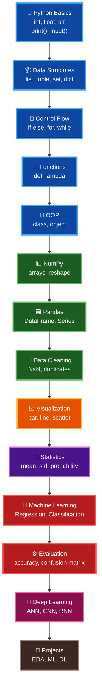

```mermaid
flowchart TD

%% ========== PYTHON CORE ==========
A["🐍 Python Basics<br/>int, float, str<br/>print(), input()"] --> B["📦 Data Structures<br/>list, tuple, set, dict"]
B --> C["🔁 Control Flow<br/>if-else, for, while"]
C --> D["🧩 Functions<br/>def, lambda"]
D --> E["🧱 OOP<br/>class, object"]

%% ========== DATA HANDLING ==========
E --> F["📊 NumPy<br/>arrays, reshape"]
F --> G["🗃 Pandas<br/>DataFrame, Series"]
G --> H["🧹 Data Cleaning<br/>NaN, duplicates"]

%% ========== VISUALIZATION ==========
H --> I["📈 Visualization<br/>bar, line, scatter"]

%% ========== STATISTICS ==========
I --> J["🧮 Statistics<br/>mean, std, probability"]

%% ========== MACHINE LEARNING ==========
J --> K["🤖 Machine Learning<br/>Regression, Classification"]
K --> L["⚙️ Evaluation<br/>accuracy, confusion matrix"]

%% ========== DEEP LEARNING ==========
L --> M["🧠 Deep Learning<br/>ANN, CNN, RNN"]

%% ========== PROJECTS ==========
M --> N["🚀 Projects<br/>EDA, ML, DL"]

%% ========== DARK UI STYLES ==========
classDef core fill:#0D47A1,color:#ffffff,stroke:#42A5F5,stroke-width:3px;
classDef data fill:#1B5E20,color:#ffffff,stroke:#66BB6A,stroke-width:3px;
classDef viz fill:#E65100,color:#ffffff,stroke:#FFB74D,stroke-width:3px;
classDef stats fill:#4A148C,color:#ffffff,stroke:#BA68C8,stroke-width:3px;
classDef ml fill:#B71C1C,color:#ffffff,stroke:#EF5350,stroke-width:3px;
classDef dl fill:#880E4F,color:#ffffff,stroke:#F06292,stroke-width:3px;
classDef proj fill:#3E2723,color:#ffffff,stroke:#A1887F,stroke-width:3px;

class A,B,C,D,E core
class F,G,H data
class I viz
class J stats
class K,L ml
class M dl
class N proj


```
