```mermaid
flowchart TD

%% ========== PYTHON CORE ==========
A["ğŸ Python Basics<br/>int, float, str<br/>print(), input()"] --> B["📦 Data Structures<br/>list, tuple, set, dict"]
B --> C["🔠Control Flow<br/>if-else, for, while"]
C --> D["🧩 Functions<br/>def, lambda"]
D --> E["🧱 OOP<br/>class, object"]

%% ========== DATA HANDLING ==========
E --> F["📊 NumPy<br/>arrays, reshape"]
F --> G["🗃 Pandas<br/>DataFrame, Series"]
G --> H["🧹 Data Cleaning<br/>NaN, duplicates"]

%% ========== VISUALIZATION ==========
H --> I["📈 Visualization<br/>bar, line, scatter"]

%% ========== STATISTICS ==========
I --> J["🧮 Statistics<br/>mean, std, probability"]

%% ========== MACHINE LEARNING ==========
J --> K["🤖 Machine Learning<br/>Regression, Classification"]
K --> L["âš™ï¸ Evaluation<br/>accuracy, confusion matrix"]

%% ========== DEEP LEARNING ==========
L --> M["🧠 Deep Learning<br/>ANN, CNN, RNN"]

%% ========== PROJECTS ==========
M --> N["🚀 Projects<br/>EDA, ML, DL"]

%% ========== DARK UI STYLES ==========
classDef core fill:#0D47A1,color:#ffffff,stroke:#42A5F5,stroke-width:3px;
classDef data fill:#1B5E20,color:#ffffff,stroke:#66BB6A,stroke-width:3px;
classDef viz fill:#E65100,color:#ffffff,stroke:#FFB74D,stroke-width:3px;
classDef stats fill:#4A148C,color:#ffffff,stroke:#BA68C8,stroke-width:3px;
classDef ml fill:#B71C1C,color:#ffffff,stroke:#EF5350,stroke-width:3px;
classDef dl fill:#880E4F,color:#ffffff,stroke:#F06292,stroke-width:3px;
classDef proj fill:#3E2723,color:#ffffff,stroke:#A1887F,stroke-width:3px;

class A,B,C,D,E core
class F,G,H data
class I viz
class J stats
class K,L ml
class M dl
class N proj


```

# 🐍 Practice All Python Topics in Data Science

  

---
<!-- ===================== REPOSITORY METRICS (NUMBERS ONLY) ===================== -->

  
  
  

  
  
  

  
  

<!-- ===================== END METRICS ===================== -->

<!-- ===================== END METRICS ===================== -->

## About This Repository

This repository is a **complete step-by-step roadmap** to master **Python for Data Science**, starting from **basic programming concepts** and moving towards **advanced Machine Learning and Deep Learning**.

It is built to:
- Strengthen Python fundamentals
- Practice Data Science tools hands-on
- Apply concepts to real-world use cases
- Showcase structured learning and consistency

---

## 🎯 Objective & Purpose

### ✅ Objectives
- Master Python from **basic to advanced**
- Learn how Python is used in **real Data Science workflows**
- Build a **strong portfolio-ready foundation**
- Prepare for **interviews, projects, and competitions**

### ✅ Purpose
- One-stop structured learning resource
- Daily practice & revision guide
- Demonstrate discipline and growth in Data Science

---

## 🧭 Learning Strategy

This repository follows a **progressive learning strategy**:

1. **Understand Concepts**
2. **Practice with Code**
3. **Apply to Real Data**
4. **Build Projects**

Each topic includes:
- Concept explanation
- Python implementation
- Practical relevance

---

## 🗂️ Learning Structure (Basic → Advanced)

---

### 🔹 1. Python Basics

**What to Learn**
- Variables & Data Types
- Input / Output
- Type Casting
- Operators

**Objective**
- Build logical thinking
- Understand Python syntax clearly

**Real-World Use**
- Writing automation scripts
- Data preprocessing logic

---

### 🔹 2. Data Structures

**What to Learn**
- List
- Tuple
- Set
- Dictionary

**Objective**
- Efficient data storage & access

**Real-World Use**
- Feature storage
- Dataset manipulation

---

### 🔹 3. Control Flow

**What to Learn**
- if / else
- for & while loops
- break & continue
- Comprehensions

**Objective**
- Control program execution

**Real-World Use**
- Conditional data filtering
- Iterative processing

---

### 🔹 4. Functions & Modules

**What to Learn**
- Functions
- Lambda
- Modules & Packages

**Objective**
- Reusable & clean code

**Real-World Use**
- Data pipelines
- Utility functions

---

### 🔹 5. Object-Oriented Programming (OOP)

**What to Learn**
- Classes & Objects
- Inheritance
- Polymorphism
- Encapsulation

**Objective**
- Scalable project design

**Real-World Use**
- ML pipelines
- Custom dataset classes

---

### 🔹 6. NumPy (Numerical Computing)

**What to Learn**
- Arrays
- Indexing & slicing
- Broadcasting
- Vector operations

**Objective**
- Fast numerical computation

**Real-World Use**
- Mathematical modeling
- Feature transformation

---

### 🔹 7. Pandas (Data Analysis)

**What to Learn**
- Series & DataFrame
- Filtering & sorting
- GroupBy
- Merge & Join

**Objective**
- Data analysis mastery

**Real-World Use**
- Exploratory Data Analysis (EDA)
- Business insights

---

### 🔹 8. Data Cleaning & Preprocessing

**What to Learn**
- Missing value handling
- Outlier detection
- Encoding
- Scaling

**Objective**
- Prepare high-quality data

**Real-World Use**
- Industry datasets
- ML-ready data

---

### 🔹 9. Data Visualization

**What to Learn**
- Matplotlib
- Seaborn
- Plot types

**Objective**
- Visual storytelling

**Real-World Use**
- Dashboards
- Reports & presentations

---

### 🔹 10. Statistics & Probability

**What to Learn**
- Mean, Median, Mode
- Variance & Std Dev
- Probability
- Hypothesis Testing

**Objective**
- Analytical thinking

**Real-World Use**
- A/B testing
- Model assumptions

---

### 🔹 11. Machine Learning

**What to Learn**
- Supervised Learning
  - Linear Regression
  - Logistic Regression
  - Decision Trees
- Unsupervised Learning
  - Clustering
  - PCA

**Objective**
- Predictive modeling

**Real-World Use**
- Sales prediction
- Customer segmentation

---

### 🔹 12. Model Evaluation

**What to Learn**
- Train-Test Split
- Cross Validation
- Metrics

**Objective**
- Reliable model evaluation

**Real-World Use**
- Model comparison
- Performance optimization

---

### 🔹 13. Deep Learning

**What to Learn**
- Artificial Neural Networks
- CNN
- RNN

**Objective**
- Advanced AI skills

**Real-World Use**
- Image classification
- NLP & time series

---

### 🔹 14. Real-World Projects

**What to Build**
- EDA Projects
- ML Projects
- DL Projects

**Objective**
- Hands-on experience
- Portfolio building

---

## Summary

✔ Covers **complete Python Data Science roadmap**  
✔ Beginner-friendly → Advanced level  
✔ Focus on **practice + application**  
✔ Ideal for **students, job seekers & professionals**

---

## 🔗 Connect With Me

  
  
  

---
